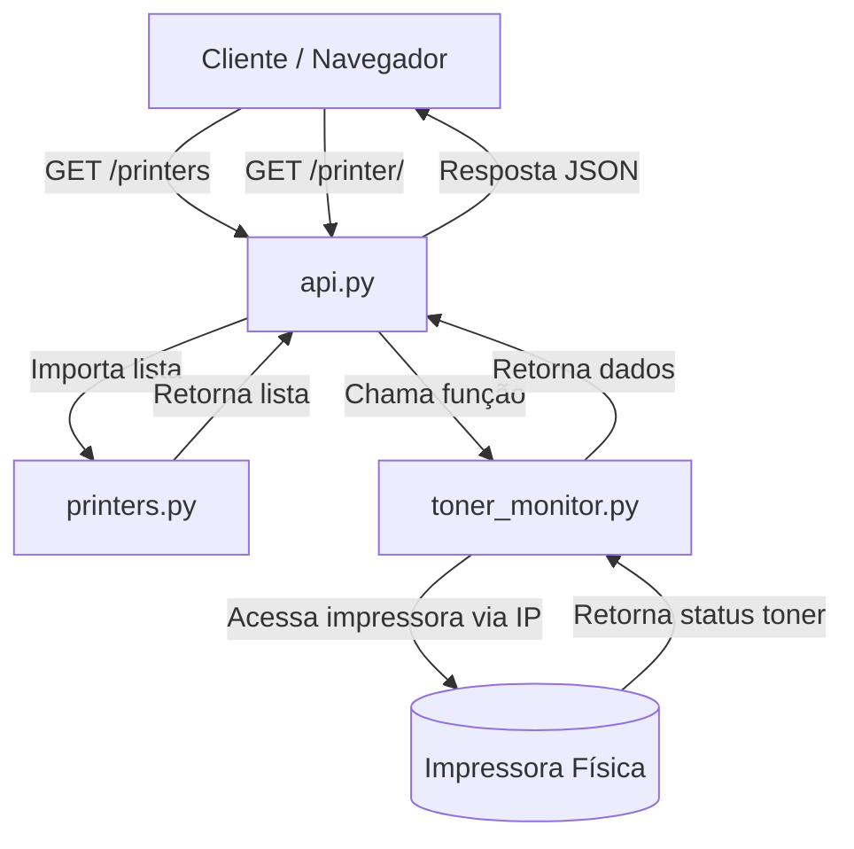

# 🖨️ Printer Monitor API

API simples em **Python Flask** para listar impressoras do INPE via rede e obter informações detalhadas, incluindo status dos toners.

---

## 📂 Estrutura do Projeto

```
.
├── api.py              # Arquivo principal da API Flask
├── printers.py         # Lista de impressoras cadastradas
├── toner_monitor.py    # Funções para acessar impressoras e obter informações
├── requirements.txt    # Dependências do projeto
└── README.md           # Este arquivo 😄
```

---

## 📋 Dependências

As bibliotecas usadas estão listadas em `requirements.txt`.  
Instale todas com:

```bash
pip install -r requirements.txt
```

**requirements.txt**:
```
beautifulsoup4==4.13.4
blinker==1.9.0
click==8.2.1
colorama==0.4.6
Flask==3.1.1
itsdangerous==2.2.0
Jinja2==3.1.6
MarkupSafe==3.0.2
soupsieve==2.7
typing_extensions==4.14.1
Werkzeug==3.1.3
```

---

## 🚀 Executando a API

```bash
python api.py
```

Por padrão, a API ficará disponível em:

```
http://127.0.0.1:5000
```

---

## 📡 Endpoints

### 1️⃣ **Listar todas as impressoras**

```
GET /printers
```

**Resposta de exemplo:**
```json
[
    {
        "id": 1,
        "local": "Prédio",
        "nome": "Impressora 1",
        "ip": "190.168.0.10",
        "modelo": "HP Printer",
        "color": true
    }
]
```

---

### 2️⃣ **Obter informações de uma impressora pelo ID**

```
GET /printer/<id>
```

**Parâmetros:**
- `id` → Identificador numérico da impressora.

**Resposta de exemplo (sucesso):**
```json
{
    "id": 1,
    "local": "Prédio",
    "nome": "Impressora 1",
    "ip": "190.168.0.10",
    "modelo": "HP Printer",
    "color": true,
    "toners": {
        "preto": 80,
        "ciano": 60,
        "magenta": 55,
        "amarelo": 70
    }
}
```

**Resposta de exemplo (não encontrada):**
```json
{
    "error": "Impressora não encontrada"
}
```
_Status HTTP: **404**_

**Resposta de exemplo (erro interno):**
```json
{
    "error": "Internal Server Error",
    "message": "Não foi possível obter os dados da impressora no momento"
}
```
_Status HTTP: **500**_

---

## 🛠️ Arquivo `printers.py`

Exemplo de lista de impressoras cadastradas:

```python
PRINTERS = [
    {
        "id": 1,
        "local": "Prédio",
        "nome": "Impressora 1",
        "ip": "190.168.0.10",
        "modelo": "HP Printer",
        "color": True
    }
]
```

---

## 🔄 Fluxo da Aplicação



💡 **Explicação do fluxo**  
1. O cliente faz uma requisição HTTP para a API.  
2. O `api.py` é o ponto de entrada que recebe as requisições.  
3. Para `/printers`, ele lê diretamente o array `PRINTERS` do `printers.py`.  
4. Para `/printer/<id>`, ele:
   - Busca a impressora na lista (`printers.py`).  
   - Usa `toner_monitor.py` para coletar informações detalhadas.  
   - Consulta a impressora pelo IP e processa os dados.  
5. A API retorna a resposta em JSON para o cliente.  

---

## 📜 Licença

Este projeto é open source, sinta-se livre para modificar e adaptar.
